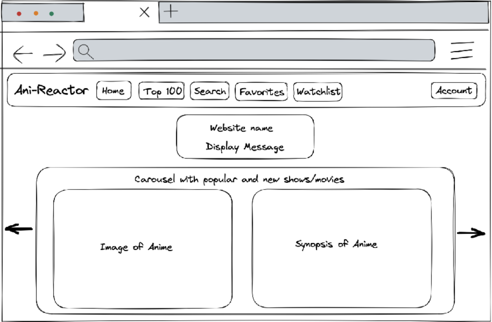
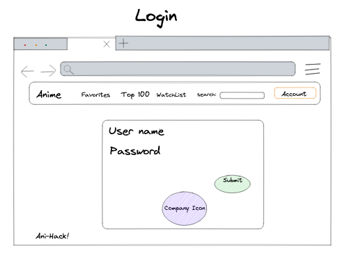

# Customer Graphical Human Interface 

## Home Page

This will be the first page that the consumer will observe. There will be a drop down with the fields of account details, account edit form, watchlist form, and favorites form. 

## Home Page (Logged in)

## Sign-up Form 

The sign up for will display the fields of first name, last name, email, username, password, and a confirm password field. After the individual signs up it will redirect them to the mainpage with all of the features.

## Login Form 

If a returning account has gone through the sign up process they need to log in with their unique username and password fields. 

## Account Details 

## Edit Profile Form

## Search List 

