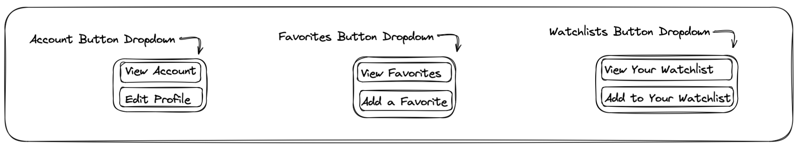
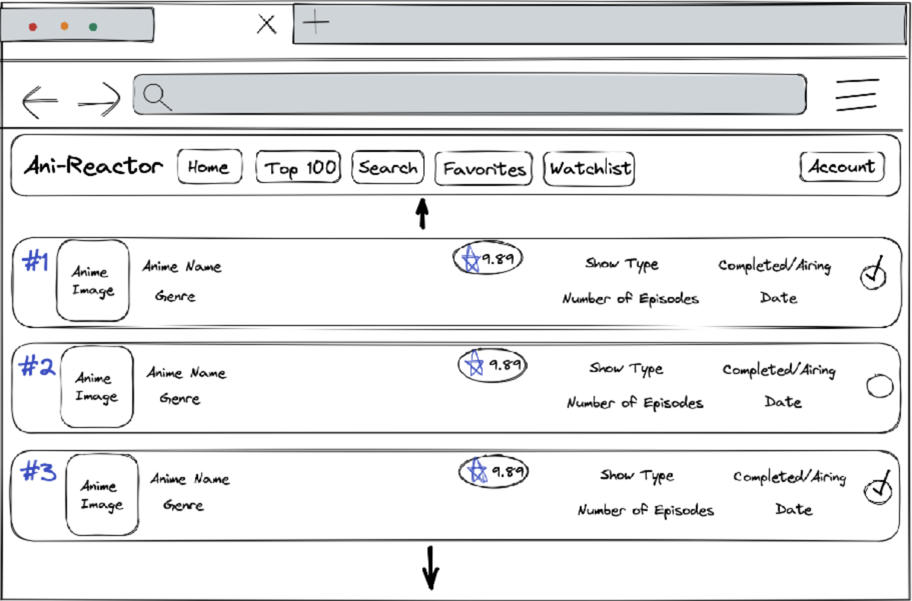
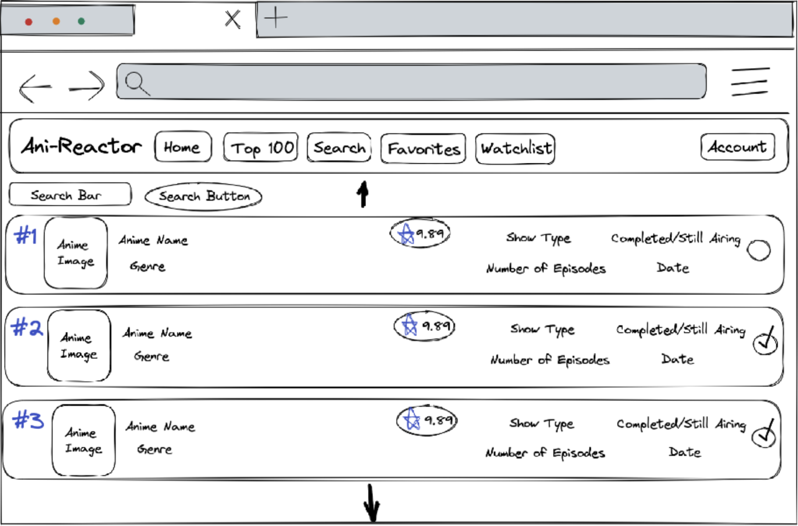
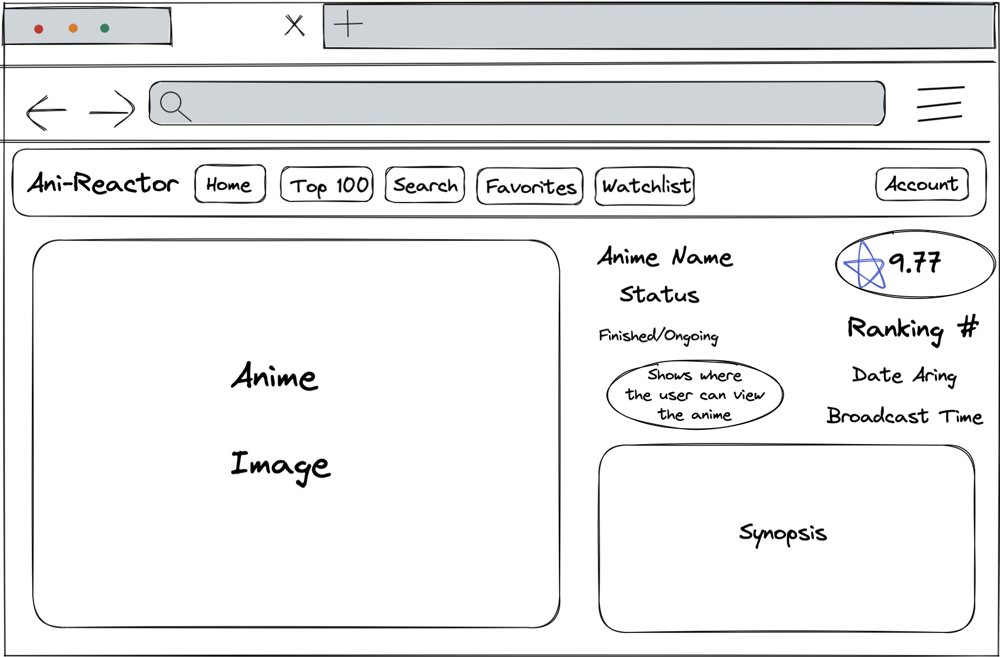
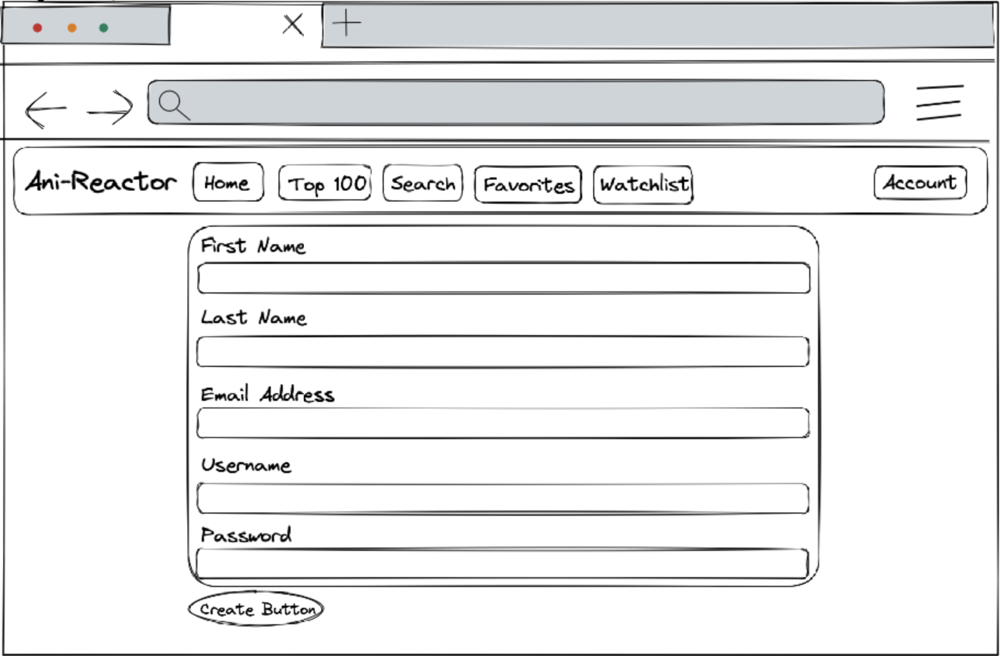
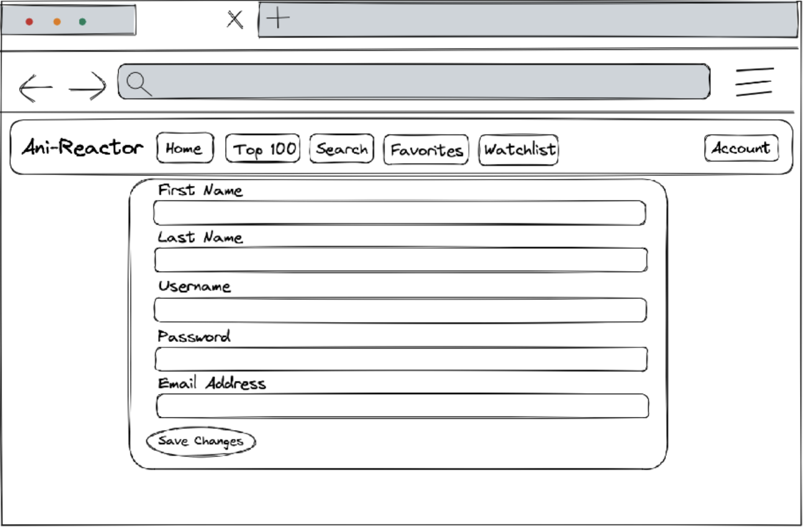

# Customer Graphical Human Interface 

## Dropdown Menu

## Main Page
When visitors visit our page they will see the main page with a carousel of popular anime! 

## Top 100
Once they are signed in they will be able to scroll through the most highly ranked anime from other users.

## Search List
If someone knwos what they want to view or if they want to adventure the website they will be able to use the search function. 

## Anime Detail View 
When a visitor clicks on an anime it will show details to help them understand what the anime will be about and possibly spark their interest in that anime. 

## Sign Up Form
The sign up form will require the users first name, last name, email address, username, and password. 

## Login
When a returning user comes back to the website they will be able to log into their account to access members only access of a customized favorites and watchlist page.

## Account Detail View 
The user can see what their account information by clicking the view account button. This will present their current information. 

## Profile Edit Form
If for some reason the user wants to change their information, they can proceed to the profile edit form to change their first name, last name, username, password, or email address. 
